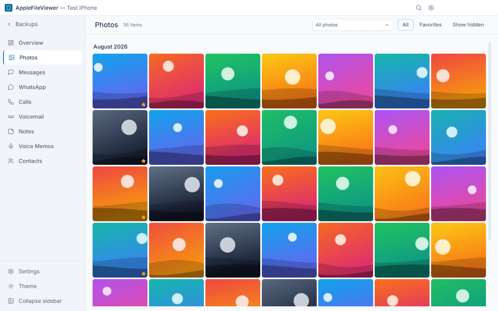
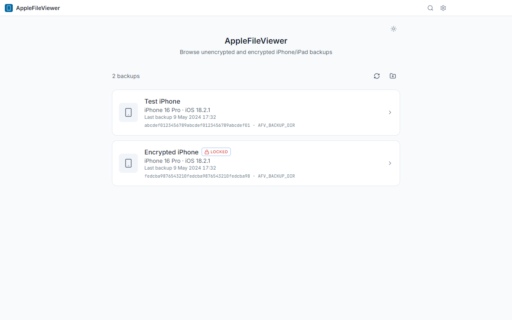
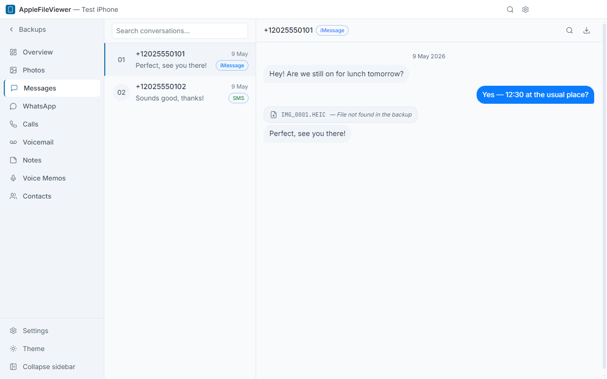
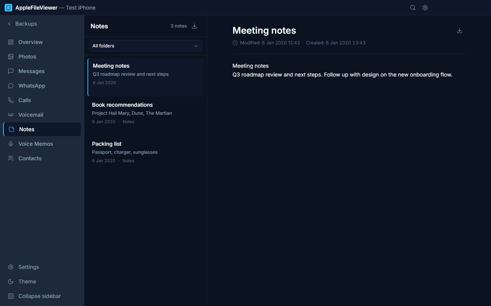
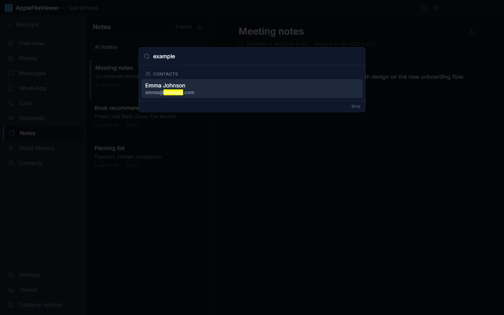
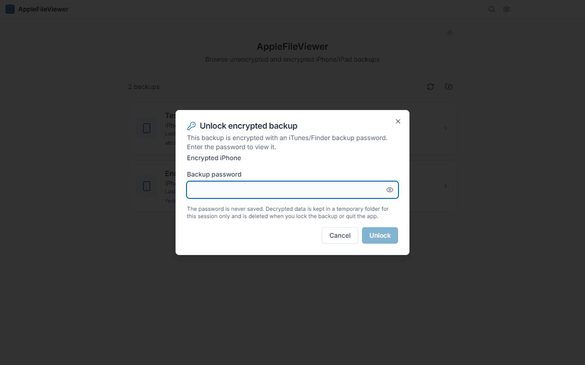
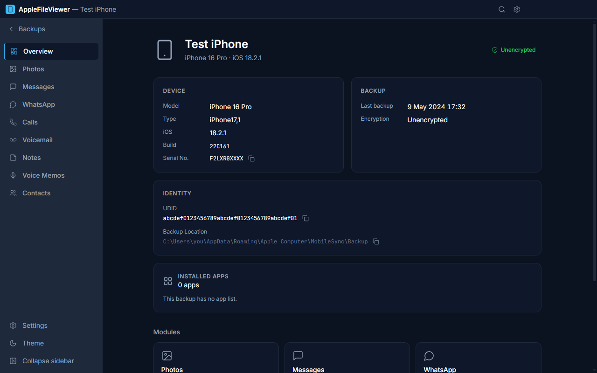

# AppleFileViewer

**A free, open-source desktop viewer for iPhone backups — Windows, macOS and Linux.**

AppleFileViewer opens the local backups that iTunes, Finder or the Apple Devices app create on your
computer and lets you browse your photos, messages, WhatsApp chats, calls, voicemail, notes, voice
memos and contacts. It works fully offline, never modifies your backup, and also supports
**encrypted (password-protected) backups**.

Website: <https://gokhanozgezer.github.io/applefileviewer/>



## Features

- **Photos & videos** — camera roll with albums, favorites and smart albums (videos, Live Photos,
  selfies, screenshots, panoramas, recently deleted); HEIC and video playback without extra codecs.
- **Messages** — iMessage/SMS threads with attachments.
- **WhatsApp** — private and group chats with sender names and media.
- **Calls & voicemail** — call history, playable voicemail recordings.
- **Notes** — Apple Notes with folders and rich text.
- **Voice Memos** and **Contacts**.
- **Global search** (Ctrl/⌘ + K) across messages, chats, notes and contacts.
- **Export** to PDF, HTML, CSV, TXT, JSON and vCard; copy original media files.
- **Encrypted backups** — unlock with the backup password; decrypted data is wiped on lock/exit.
- English and Turkish UI, light and dark theme.

## Screenshots

All screenshots are taken from the real app with a **synthetic** demo backup
(`npm run screenshots`).

| Backups                                                   | Messages                                                | Notes                                                  |
| --------------------------------------------------------- | ------------------------------------------------------- | ------------------------------------------------------ |
|  |  |        |
| **Global search**                                         | **Encrypted backup**                                    | **Overview**                                           |
|         |      |  |

## Download

Always the latest version:

| Platform                        | File                                                                                                                                                     |
| ------------------------------- | -------------------------------------------------------------------------------------------------------------------------------------------------------- |
| Windows 10/11 (x64) — installer | [AppleFileViewer-Windows-Setup.exe](https://github.com/gokhanozgezer/applefileviewer/releases/latest/download/AppleFileViewer-Windows-Setup.exe)         |
| Windows 10/11 (x64) — portable  | [AppleFileViewer-Windows-Portable.exe](https://github.com/gokhanozgezer/applefileviewer/releases/latest/download/AppleFileViewer-Windows-Portable.exe)   |
| macOS — Apple Silicon (M1–M4)   | [AppleFileViewer-macOS-arm64.dmg](https://github.com/gokhanozgezer/applefileviewer/releases/latest/download/AppleFileViewer-macOS-arm64.dmg)             |
| macOS — Intel                   | [AppleFileViewer-macOS-x64.dmg](https://github.com/gokhanozgezer/applefileviewer/releases/latest/download/AppleFileViewer-macOS-x64.dmg)                 |
| Linux (x86_64) — AppImage       | [AppleFileViewer-Linux-x86_64.AppImage](https://github.com/gokhanozgezer/applefileviewer/releases/latest/download/AppleFileViewer-Linux-x86_64.AppImage) |
| Debian / Ubuntu (amd64) — .deb  | [AppleFileViewer-Linux-amd64.deb](https://github.com/gokhanozgezer/applefileviewer/releases/latest/download/AppleFileViewer-Linux-amd64.deb)             |

Older versions and release notes: [Releases](https://github.com/gokhanozgezer/applefileviewer/releases).

## First launch (the app is unsigned)

The builds are **not code-signed** (certificates cost money every year and this is a free
project), so your OS warns you the first time. The source and the build pipeline are public.

**Windows** — if _"Windows protected your PC"_ (SmartScreen) appears, click **More info → Run
anyway**.

**macOS**

1. Open the `.dmg` and drag **AppleFileViewer** to **Applications**.
2. Open it once; when macOS says it cannot verify the developer, go to **System Settings → Privacy
   & Security**, scroll down and click **Open Anyway**. Or in Terminal:
   ```bash
   xattr -dr com.apple.quarantine /Applications/AppleFileViewer.app
   ```
3. Grant **Full Disk Access** (System Settings → Privacy & Security → Full Disk Access → add
   AppleFileViewer). Without it macOS hides the backup folder from every app.

**Linux**

```bash
chmod +x AppleFileViewer-Linux-x86_64.AppImage
./AppleFileViewer-Linux-x86_64.AppImage     # Ubuntu 22.04+: sudo apt install libfuse2
# or
sudo apt install ./AppleFileViewer-Linux-amd64.deb
```

## Where are the backups?

| OS      | Location                                                                                                                                                                |
| ------- | ----------------------------------------------------------------------------------------------------------------------------------------------------------------------- |
| Windows | `%APPDATA%\Apple Computer\MobileSync\Backup` (iTunes) · `%USERPROFILE%\Apple\MobileSync\Backup` (Apple Devices / Microsoft Store iTunes)                                |
| macOS   | `~/Library/Application Support/MobileSync/Backup` (needs Full Disk Access)                                                                                              |
| Linux   | No default — copy a backup folder from a Windows PC/Mac, or create one with libimobiledevice (`idevicebackup2 backup --full <folder>`) and choose the folder in the app |

The default folders are scanned automatically; any other folder (e.g. an external drive) can be
chosen from the backup list.

## Privacy

- **Fully offline.** No account, no cloud, no uploads. Your data never leaves your computer.
- **No telemetry**, analytics or tracking. The only optional network access is checking GitHub
  Releases for a newer version.
- **Read-only.** Backup files are never modified; the app works on temporary copies.
- **Encrypted backups:** the password is never stored; decrypted files live in a per-session
  temporary folder that is deleted when you lock the backup or quit the app.

## Build from source

Requirements: Node.js 22, npm, and the platform build tools for native modules
(Windows: Visual Studio Build Tools; macOS: Xcode Command Line Tools; Linux: `build-essential`,
`python3`).

```bash
git clone https://github.com/gokhanozgezer/applefileviewer.git
cd applefileviewer
npm ci            # postinstall rebuilds native modules (better-sqlite3) for Electron
npm run dev       # development
npm test          # unit tests (run inside Electron's Node)
npm run test:e2e  # end-to-end tests on a synthetic backup
npm run build     # installers for the current OS → release/<version>/
```

Releases are built and published by GitHub Actions — see [docs/RELEASING.md](docs/RELEASING.md).

## License

[MIT](LICENSE) © 2026 [Gokhan OZGEZER](https://github.com/gokhanozgezer).

You may use, copy, fork, modify and redistribute this software, commercially or not. The only
condition is keeping the copyright and license notice.

## Attribution

If you fork this project, build on it or ship a derivative, please credit the original author
visibly (for example in your README and About screen):

> Based on [AppleFileViewer](https://github.com/gokhanozgezer/applefileviewer) by
> [Gokhan OZGEZER](https://github.com/gokhanozgezer).

Thank you!

---

_iPhone, iTunes and Finder are trademarks of Apple Inc. WhatsApp is a trademark of its respective
owner. This project is independent and not affiliated with or endorsed by Apple or WhatsApp._
